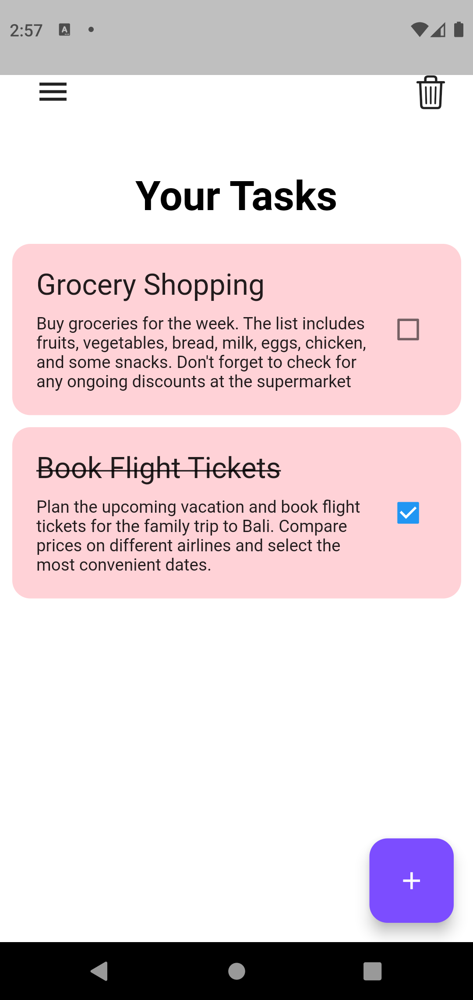

# Flutter Todo App With ShowcaseView

This is a simple Todo App created using Flutter. Showcase view is also implemented in the app.

## Features

- Showcase view for using app.
- Add new tasks to the todo list.
- Mark tasks as completed or incomplete.
- Delete tasks from the todo list.
- Clear all completed tasks with a single click.

## Screenshots




## Requirements

- Flutter SDK (follow the official guide to install: https://flutter.dev/docs/get-started/install)
- Any compatible IDE (Android Studio / VSCode / IntelliJ)

## Getting Started

1. Clone this repository to your local machine using:

   ```bash
   git clone https://github.com/letscodecraft/todo_showcase.git